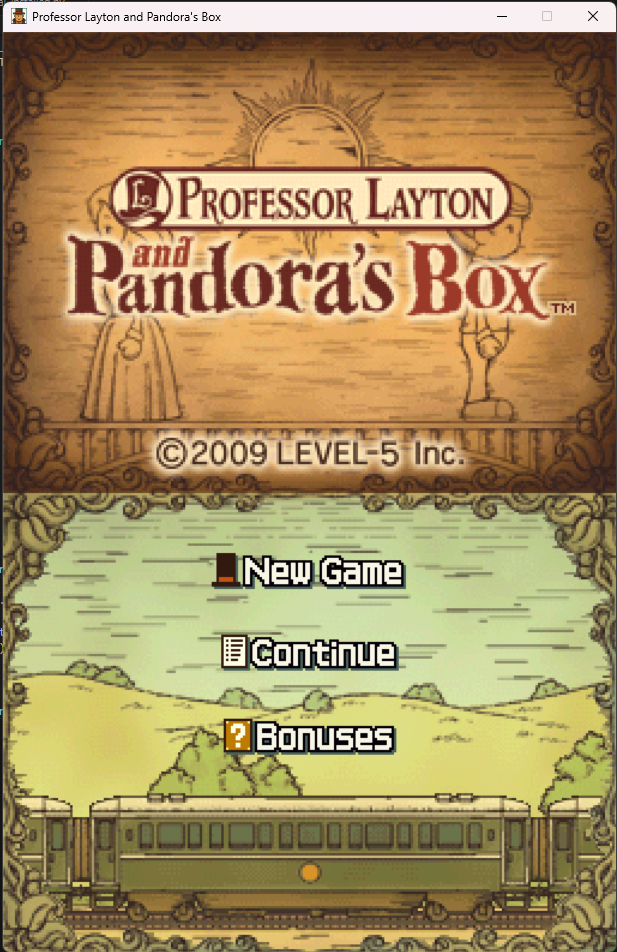
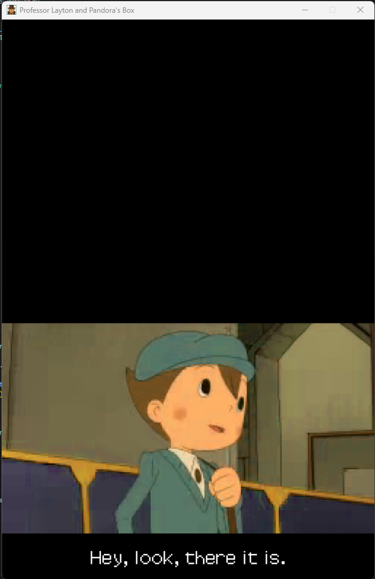
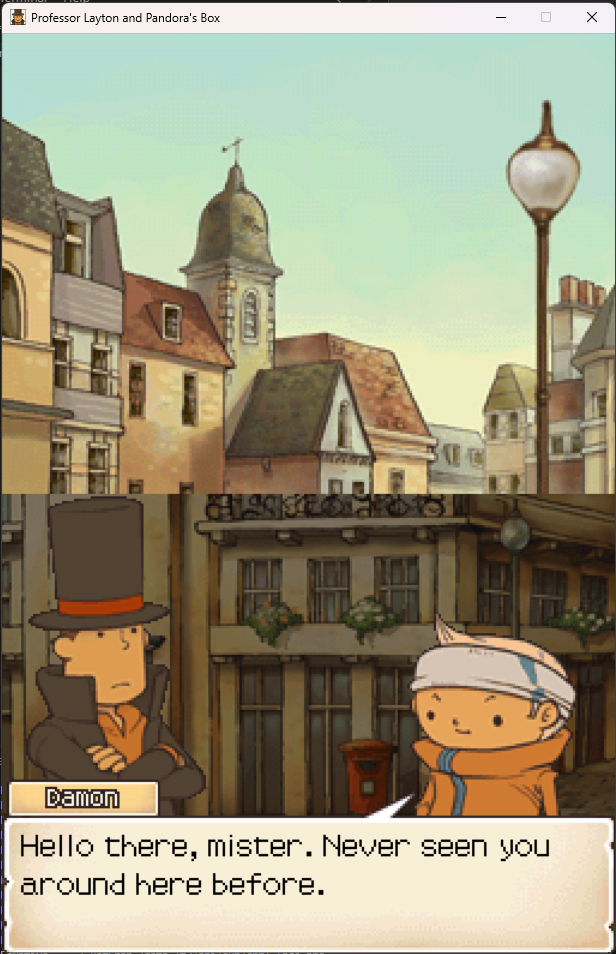
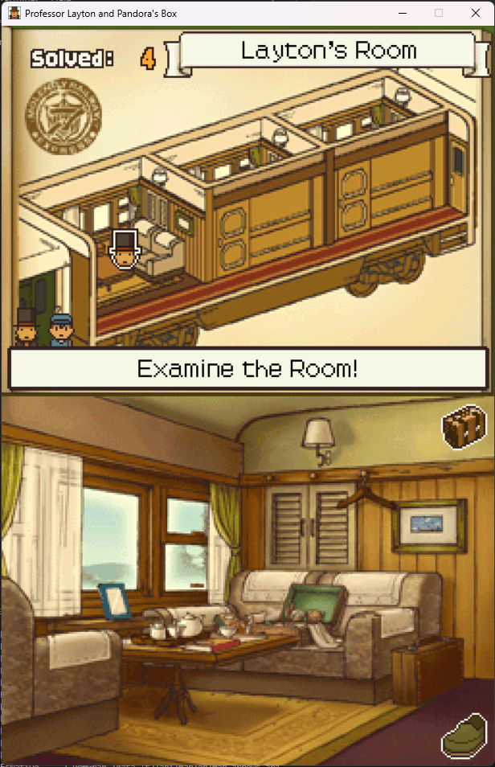
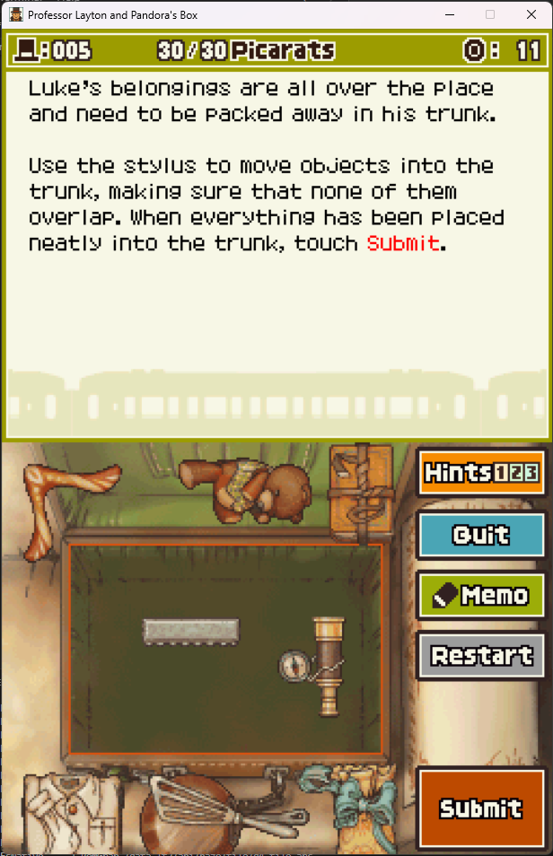

# widebrim
<p align="middle">
  
  
  
  
  
  <br><i>assets by Level-5, running in widebrim</i>
</p>

widebrim is a Python-based high-level engine recreation for the Nintendo DS version of LAYTON2 <i>(Professor Layton and the Diabolical Box / Professor Layton and Pandora's Box)</i> for completing the game **natively, without emulation** on any compatible system.

## What is widebrim for?
widebrim exists for research purposes. It was created as an evolution of [shortbrim](https://github.com/bullbin/shortbrim), a project able to run small scenarios from LAYTON1 and LAYTON2. While these games have long been playable on other hardware via emulation, widebrim serves to document how the engine works in its entirety through the form of a functional prototype.

## How accurate is widebrim?
widebrim is best described as semi-accurate:
 
 - widebrim was based on research from decompiling the European variant of LAYTON2, i.e. Professor Layton and Pandora's Box. It can only replicate bugs in that version of the game, although that doesn't stop it from running other versions (including demos from other regions!) albeit with caveats due to regional differences.
 
 - widebrim follows some similar ideas to the original game in terms of code structure by introducing the same hardcoded constants, some similar classes and the splitting of overlay code into "gamemodes". **It is not a decompilation, nor does it try to share any meaningful functions with the actual game.** widebrim is a reinterpretation of the code - it runs on pygame so cannot copy the same event handling systems by principle.

 - widebrim only reimplements core ideas. Code for handling puzzles, for example, is only accurate down to reading the puzzle parameters, gameplay modifiers and intended solutions; the rest is new code with the same gameplay. Bugs relying on fringe cases in the original code are not expected to be replicated. widebrim itself may even introduce bugs!

 - widebrim takes shortcuts to generalise behaviour; hardcoded effects in puzzles will be missing and the ending sequence, while playable, is not guaranteed to save as intended to be resumed later.

 - **widebrim does not emulate anything**. Bugs resulting from memory corruption or buffer overruns (e.g., loading an image that exceeds the free RAM capacity of the DS) will not be replicated.

 - widebrim doesn't implement everything; some minor graphical effects may be missing, minigames are missing and sound is not implemented.

 - ...on the other hand, widebrim has its own implementation of nearly every gamemode and goes above and beyond to implement recreations of unused scripting commands too.

 -  To finish with some positives, bugs that occur due to game design faults like progression not tracking correctly, sprites being placed incorrectly, puzzles missing solutions, hints missing, etc. are expected to be replicated in widebrim.

As a realistic depiction of accuracy, widebrim can be used to play LAYTON2 from start to finish with every critical puzzle playable along the way. Saves can be transferred and accepted by the DS; if you have a firmware dump, secret codes for bonus content even match real hardware. widebrim is not complete - it will probably never be 'complete' - but is a fun toy regardless.

As there are some limitations and exotic requirements, widebrim is not intended as a porting platform any more than a debugging platform; it can be useful for previewing rooms and events, inspecting the state of the game and finding issues during loading by inspecting what files the engine attempted to load for each scene. It's (been 😉) especially useful for rapidly testing game modding. widebrim works well as a preview engine for an editor (😉), but crucially widebrim can be used for future game engine recreations without having to waste as much time decompiling the game again!

## How do I install this?
Getting widebrim launchable is as easy as installing the requirements. Using a command line running in the same folder as widebrim, run
```
pip install -r requirements.txt
```
This will get the engine in a state where it can be launched, but movie playback will be skipped and the game will be uncompletable due to handwriting puzzles not being solvable. The engine currently relies on Tesseract-OCR for input recognition (this will hopefully change, it has poor performance and is overkill), so [please follow these instructions for your platform to get prerequisites for pytesseract working correctly.](https://tesseract-ocr.github.io/tessdoc/Installation.html)

To get movies working, you will need to install FFMPEG 4.4 or greater and add it to your PATH. Follow any tutorial to do so; if you can run the following in your terminal anywhere, it is installed correctly:

    ffmpeg -version

`check_optional_installed.py` is a bundled script that can check whether Tesseract-OCR and FFMPEG are installed correctly. It won't check other requirements so make sure you've installed everything in `requirements.txt`.

## How do I use this?

### I just want the game running. I don't care about settings.
By default, the engine is configured to run at 60fps and look for a ROM called `rom2.nds` in the working directory; for obvious reasons, this is not included. It will save the game under `rom2.sav`; this is compatible with both emulators and hardware. To run without any modifications, you will need a copy of the ROM for Professor Layton and Pandora's Box (YLTP). Place it in the root widebrim folder beside `launcher.py`. To check if your install is capable of running widebrim as intended, start by running `check_optional_installed.py` to check if FFMPEG and Tesseract-OCR are working as intended. If these pass, start `launcher.py` to play the game.

The game is largely controlled by mouse inputs so can be played by anything that emits a click. Touchscreens or drawing tablets are recommended but a mouse is good too. A keyboard is not necessary but the following shortcuts are provided:

 - ENTER skips the active movie, i.e. like pressing START on the DS
 - While holding TAB, the engine runs at 4x speed for debugging purposes.

For the most part, the game plays exactly as you remember. In some cases, i.e., handwriting puzzles, missing graphics and functionality may make the puzzles harder to solve than intended. Keep an eye on terminal output to keep up with data entry in those scenarios.

### Ok, what can I change to break everything?
Currently, widebrim stores environment settings inside `widebrim/engine/config.py`. Each variable has a corresponding description, but here are some recommended changes:

 - `TIME_FRAMERATE` can be modified to adjust the framerate to match your display. By default, 60fps is chosen in line with the DS title, but any (sane) value is okay. widebrim is framerate-independent and will translate DS timings to fit your selected interval. Higher framerates may be more expensive due to more busy-waiting as the engine doesn't use pygame's traditional clock setup.
 
 - `PATH_ROM` and `PATH_SAVE` are pretty self-explanatory, but modify these to change where widebrim reads its ROM and saves the game.
 - `WINDOW_SCALE_TO_VIEW` expands the window by integer scaling to fit the screen. The engine itself is not very complex and cannot be resized so this is recommended to be set to `True` otherwise the game will run at DS resolution and be hard to control.
 - `WINDOW_USE_VSYNC` controls whether vertical sync is enabled. This helps eliminate tearing but **if you are seeing a black screen but can see widebrim is accessing files, you may want to disable this** - pygame sometimes breaks with VSync enabled.
 - `NDS_USE_FIRMWARE_MAC` is useful for debuggers looking to match behaviour with NDS. If you have a dump for the firmware of your DS, enabling this and setting the corresponding `NDS_PATH_FIRM` to your binary will ensure that the secret code cipher generation matches the dumped hardware.
 - `DEBUG_BYPASS_PUZZLE_INTRO` is useful to enable if you're using widebrim for puzzle debugging, the intro graphic is forced for accuracy reasons and can be annoying to wait for every time you want to restart!
 
### I'm darksided and crave more control of the engine. What can you recommend?

Mess with the launcher! The bundled file is very barebones but during development it was very handy to force states to allow for custom playback. For example, if you wanted to launch into an event instead of start up the game, you can add this before `play(...)`is called:

    ...
    debugState.setGameMode(GAMEMODES.DramaEvent)
    debugState.setEventId(...)
    ...
You can do the same for puzzles with `GAMEMODES.Puzzle` and `setPuzzleId` or movies with `GAMEMODES.Movie` and `setMovieNum`. These do require some understanding of the engine flow, however, as it is very easy to enter an invalid state this way. widebrim exists to be broken so the game doesn't have to be!

**For people using non-EU ROMs**, messing with the launcher to immediately start `GAMEMODES.Room` instead of `GAMEMODES.Reset` will prevent a crash on `GAMEMODES.Name` to allow the game to start. This is because some variants use their own input method that differs from the EU ROM for naming your character. Once saved, you can resume the game like normal. You won't be able to name your save without resorting to library editing ([try madhatter!](https://github.com/bullbin/madhatter)) but you will be able to complete the game as if it were an EU ROM.

Finally, to help with debugging, change the parameters for `NamedLogger` at the start of the launcher. **By default, only critical and important messages are logged**. Unimportant (verbose) messages are silenced as these fill the log with spam regarding the state of asset loading. This can be helpful to find problems with custom assets or pinpoint issues with progression.

### I broke it. What now?
**Please open a GitHub issue with the command line output, your save file and steps to reproduce.** Since there isn't an easy way to transmit ROM patches (yet), proper support can only be provided for issues present when running on the original EU ROM. Some assistance may be possible for less problematic bugs on patched ROMs.

### I found something that doesn't quite match the original game...
**Also open a GitHub issue that details the inaccuracy!** widebrim has some known accuracy shortcomings but if you find anything major, please document it so it can be improved in future.

## Are there any known limitations?
widebrim is a basic engine with no creature comforts like resolution switching, keybindings or even fullscreen. It has no audio, no minigames, does not support Asian languages (largely due to font rendering issues) and has some minor graphical inaccuracies like font spacing, missing animations and missing environmental hints for the torn photo mode. **widebrim is not a DS and writes to a single screen buffer** so certain bugs relying on bad sprite positioning will not match hardware. **You may need a walkthrough to help if you're stuck due to missing information**. Getting to the end of the game functions fine in widebrim but the final save has unimplemented hardcoded behaviour that is not replicated yet; **it is not recommended you continue from a post-game save** as you may be stuck in an invalid state. While widebrim is capable of decoding the WiFi data if obtained, it makes no attempt at NWC emulation so bonus puzzles cannot be unlocked. Finally, widebrim inherits some gameplay code from shortbrim, an even higher-level implementation of the engine that did not use decompilation. A few puzzles will crash the engine as a result; none of these are critical for progression and can be resolved by giving those specific gamemodes some attention.

## Who do I blame in case you get sued?
Jokes aside, here's some personal thanks for their impact(s) on this project:

 - [nocash](https://problemkaputt.de/gba.htm) and the contributors of [melonDS](https://github.com/melonDS-emu/melonDS), [Ghidra](https://github.com/NationalSecurityAgency/ghidra), [NTR-Ghidra](https://github.com/pedro-javierf/NTRGhidra) and [ndspy](https://github.com/RoadrunnerWMC/ndspy): this project would have been impossible without you ❤️

 - The contributors of [ffmpeg](https://ffmpeg.org/) for implementing mobiclip video decoding; it singlehandedly allowed for integration of in-game cutscenes
 - Gericom for their work on [mobiclip video decoding](https://github.com/Gericom/MobiclipDecoder); ffmpeg has a few deficiencies that, thanks to their research, could be worked around
 - Anyone thanked during the creation of [madhatter](https://github.com/bullbin/madhatter); this library is at the core of the engine, providing all asset decoding and conversion behind the scenes
 
## ...what about the HD port?
 😉
